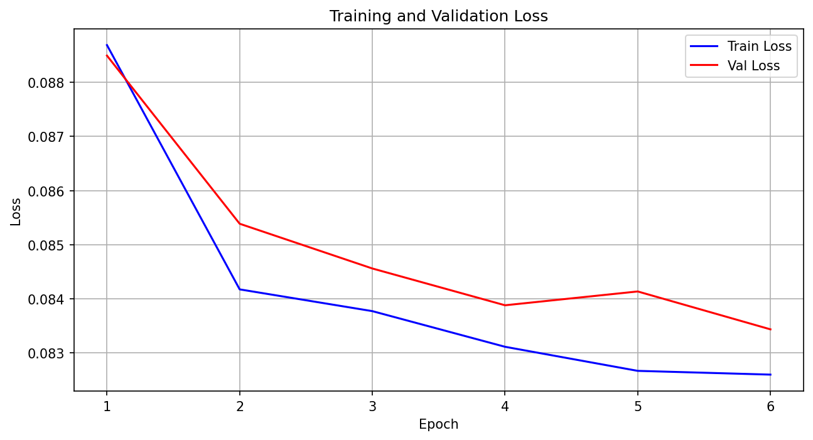
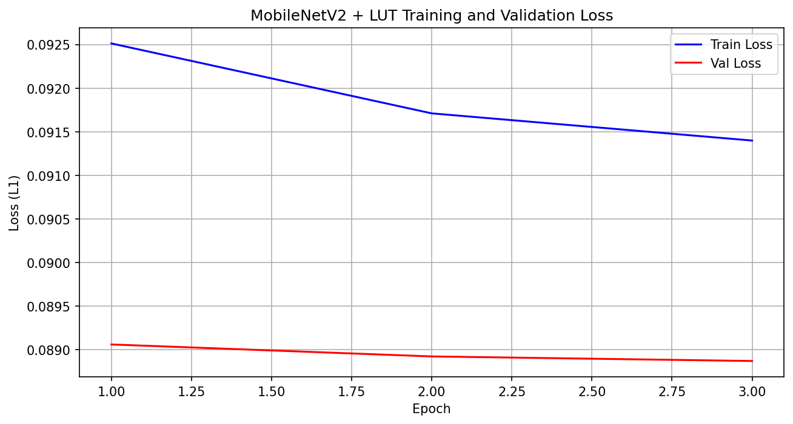
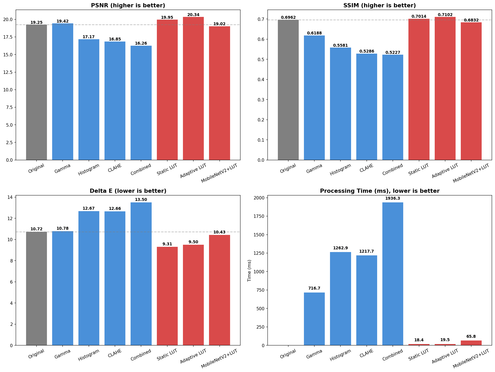
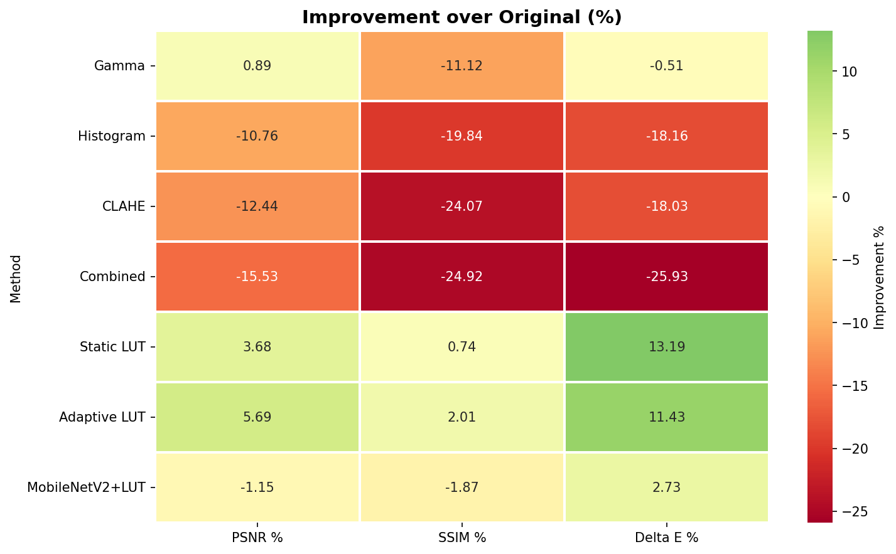
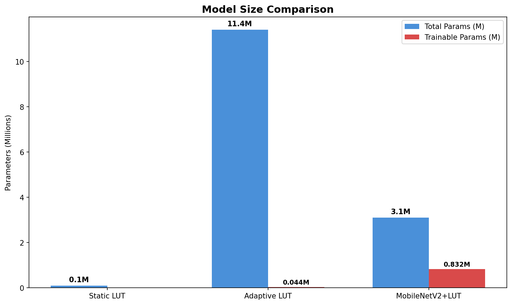
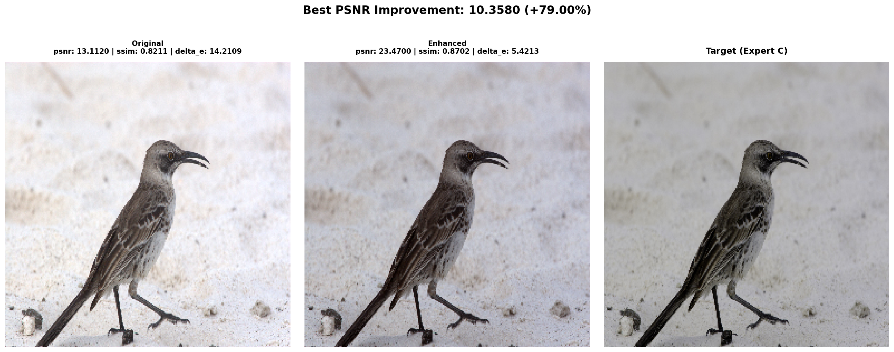
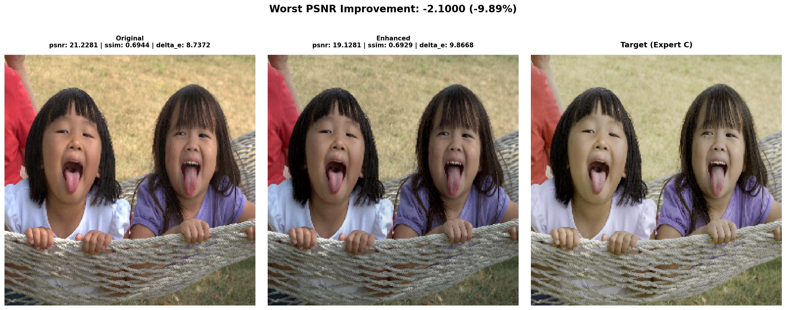
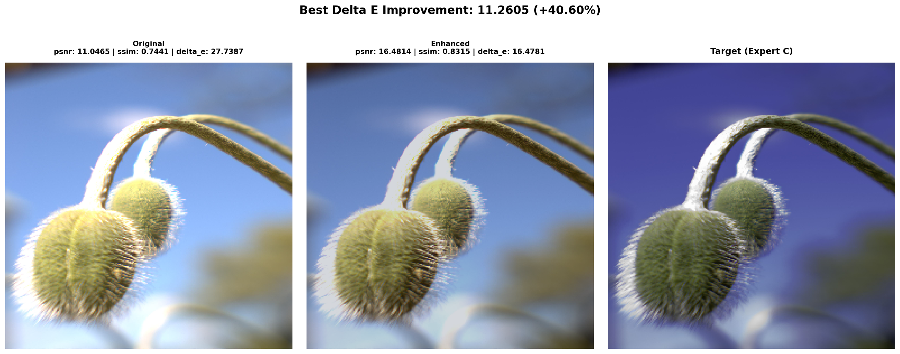
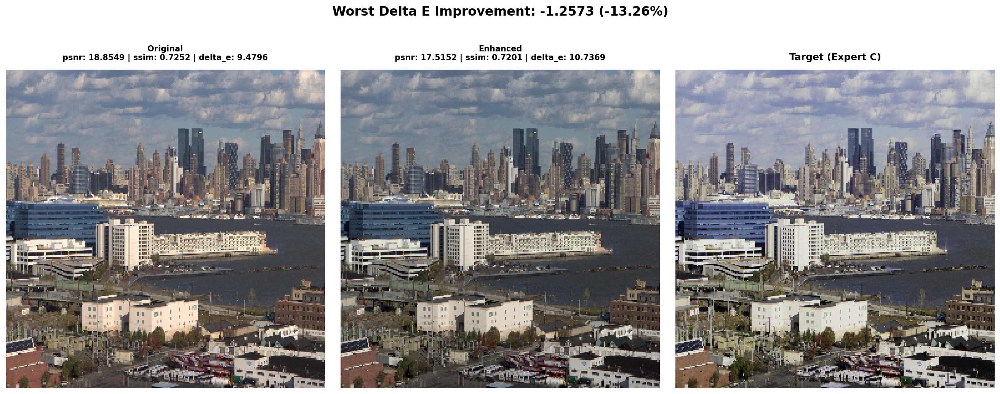

Автор: Коновалов Валентин Русланович

# Итоговый отчёт по проекту: "Интеллектуальная система улучшения изображений"

## 1. Постановка задачи

### 1.1 Описание проекта

Необходимо было разработать систему, которая автоматически улучшает фотографии — корректирует яркость, контрастность, цветовые характеристики, не изменяя идентичность и содержание изображения. Система должна быть пригодна для массового применения: real-time инференс, малый размер модели, минимальное потребление ресурсов.

### 1.2 Формальная постановка

Разработать функцию отображения:

$$f: I_{input} \rightarrow I_{enhanced}$$

где:
- $I_{input} \in [0,1]^{H \times W \times 3}$ — входное RGB-изображение
- $I_{enhanced} \in [0,1]^{H \times W \times 3}$ — улучшенное RGB-изображение

Критерии оценивания:
1. Качество — максимизация визуального качества по full-reference метрикам (PSNR, SSIM, CIEDE2000)
2. Скорость — минимизация времени инференса (target: доли секунды на CPU)
3. Общеприменимость — малый размер модели, минимальное потребление памяти и вычислительных ресурсов
4. Сохранение идентичности — содержание изображения не должно изменяться, только яркостные и цветовые характеристики

## 2. Структура проекта

```
.
├── apply_adaptive_lut.py              # Скрипт инференса
├── datasets.py                        # Деление на train/val/test
├── requirements.txt                   # Зависимости
├── 01_baseline_implementation.ipynb   # Классические методы
├── 02_static_lut.ipynb                # Статический LUT
├── 03_adaptive_lut.ipynb              # Custom CNN + LUT
├── 04_mobilenet_lut.ipynb             # MobileNetV2 + LUT
├── 05_metrics_comparison.ipynb        # Сводное сравнение всех методов
├── data_analysis.ipynb                # анализ датасета
├── mit_adobe_5k_dataset/              # Датасет
├── baseline_results/                  # Результаты классических методов
├── static_lut_results/                # Результаты статического LUT
├── adaptive_lut_results/              # Результаты адаптивного LUT
├── mobilenet_lut_results/             # Результаты MobileNetV2+LUT
├── comparison_results/                # Сводные графики сравнения
├── README.md
└── reports/                           # Отчёты
```

Все методы используют единый train/val/test сплит из `datasets.py` для идентичных условий сравнения. Датасет разделён в пропорции 3500/500/1000 изображений (train/val/test). Результаты каждого метода сохраняются в отдельную директорию.

### 2.1 Инференс обученной модели

Скрипт `apply_adaptive_lut.py` позволяет применить обученную модель адаптивного LUT к произвольному изображению. Скрипт самодостаточен — все классы модели (FeatureExtractor, ParameterGenerator, LUTGenerator, LUTApplier) определены внутри него.

Использование:

```bash
python apply_adaptive_lut.py input.jpg output.jpg

# С указанием чекпоинта
python apply_adaptive_lut.py input.jpg output.jpg --checkpoint adaptive_lut_results/best_adaptive_lut.pth
```

Параметры:
- `input` — путь к входному изображению (обязательный)
- `output` — путь для сохранения улучшенного изображения (обязательный)
- `--checkpoint` — путь к файлу чекпоинта модели (по умолчанию: `adaptive_lut_results/best_adaptive_lut.pth`)

### 2.2 Установка зависимостей

Все зависимости перечислены в файле `requirements.txt`. Для установки всех пакетов выполните:

```bash
pip install -r requirements.txt
```

Основные зависимости:
- `torch` и `torchvision` — фреймворк глубокого обучения
- `numpy` — численные вычисления
- `opencv-python` — загрузка и обработка изображений
- `scikit-image` — метрики качества (PSNR, SSIM, CIEDE2000)
- `matplotlib` и `seaborn` — визуализация результатов
- `tqdm` — прогресс-бары
- `pandas` — таблицы с результатами


## 3. Данные

### 3.1 MIT-Adobe FiveK Dataset

Используется открытый датасет MIT-Adobe FiveK, содержащий 5,000 изображений, каждое из которых независимо обработано 5 экспертами (A–E).

Структура датасета:
```
mit_adobe_5k_dataset/
├── raw/    # 5,000 исходных RAW-изображений
├── a-e/    # 5,000 изображений, обработанных каждым экспертом
```

Статистика исходных изображений:
- Ширина: 1531–6080 px (среднее 3494)
- Высота: 1296–6080 px (среднее 3039)

Эксперт C выбран в качестве целевого (его стиль наиболее понятен и рекомендуется в задании).

### 3.2 Анализ распределений

Для 500 случайных изображений подсчитаны изменения трёх характеристик после обработки экспертом C:

| Параметр | Среднее изменение | Стандартное отклонение |
|----------|:-----------------:|:----------------------:|
| Яркость (LAB L) | −5.82 | 24.02 |
| Контраст (std L) | +3.93 | 8.24 |
| Насыщенность (HSV S) | −4.62 | 28.72 |

Наблюдения:
- Эксперт C в среднем понижает яркость (негативное среднее — фотографии чаще затемняются)
- Контраст повышается — изображения становятся более выразительными
- Насыщенность незначительно понижается, распределение симметрично относительно нуля
- Изменения неравномерны: std у всех параметров велика, значит разные изображения требуют разной обработки

### 3.3 Типы недостатков исходных изображений

На основе анализа выделены категории изображений, требующие наибольших изменений:
- Пересвеченные — требуется коррекция экспозиции в −
- Недосвеченные — требуется поднятие яркости
- Низкий контраст — плоские, блёклые изображения
- Высокий контраст — жёсткие тени, пересветы

Существенная часть изображений (∼30%) не требует значительных изменений — алгоритм должен сохранять неизменными уже хорошие фотографии.


## 4. Метрики качества

### 4.1 Full-reference метрики (сравнение с экспертом C)

Поскольку датасет содержит целевые изображения (обработанные экспертом C), используются full-reference метрики:

| Метрика | Описание | Диапазон | Направление |
|---------|----------|:--------:|:-----------:|
| PSNR | Пиковое отношение сигнала к шуму (dB) | 0–inf | Выше = лучше |
| SSIM | Структурное сходство | [0, 1] | Выше = лучше |
| ΔE (CIEDE2000) | Цветовое различие в LAB | 0–inf | Ниже = лучше |

Обоснование выбора:
- Поскольку датасет содержит эталонные изображения (обработанные экспертом C), full-reference метрики дают объективную количественную оценку качества: PSNR измеряет точность восстановления пикселей, SSIM — структурное сходство, CIEDE2000 — цветовое различие в перцептуально равномерном пространстве LAB.
- No-reference метрики (FID, LPIPS) не использовались, так как есть возможность сравниваться с эталонными вариантами C напрямую


## 5. Методы

Для решения задачи реализованы и сравнены 7 методов, разделённых на две категории: классические (baseline) и LUT-ориентированные.

### 5.1 Классические методы (Baseline)

#### 5.1.1 Гамма-коррекция

Степенная коррекция яркости $I_{out} = c \cdot I_{in}^{\gamma}$ с параметрами $c=1$, $\gamma=0.8$ (эмпирически). $\gamma < 1$ осветляет тёмные области, $\gamma > 1$ затемняет светлые.

- Плюсы: детерминированность, $O(H \times W)$, не требует обучения
- Минусы: единый $\gamma$ для всех изображений не адаптируется к контенту

#### 5.1.2 Гистограммное выравнивание (Histogram Equalization)

Перераспределение интенсивностей пикселей для равномерной гистограммы: $P_{out}(k) = \frac{1}{N} \sum_{i=0}^{k} h(i)$. Применяется независимо к каждому RGB-каналу.

- Плюсы: повышает контраст
- Минусы: создаёт артефакты (banding) и неестественные цвета

#### 5.1.3 CLAHE (Contrast Limited Adaptive Histogram Equalization)

Локальное выравнивание гистограммы: изображение делится на тайлы $8 \times 8$, в каждом — выравнивание с clip limit = 2.0 и билинейная интерполяция между тайлами. Применяется только к L-каналу в LAB.

- Плюсы: мягче глобального выравнивания
- Минусы: параметры фиксированы для всех изображений

#### 5.1.4 Комбинированный метод (CLAHE → Gamma)

Последовательное применение CLAHE для контраста и гамма-коррекции для яркости.

- Плюсы: более гибок, чем каждый метод по отдельности
- Минусы: два последовательных преобразования удваивают время обработки, параметры не оптимизированы совместно

### 5.2 LUT-ориентированные методы

Общая идея: LUT (Look-Up Table) — трёхмерная таблица размером $N \times N \times N$ (здесь $N=33$), где каждая точка $(r,g,b)$ отображается в новое значение $(r',g',b')$. Для промежуточных значений используется трилинейная интерполяция.

Преимущества LUT-подхода:
- Сохранение идентичности: каждое входное значение отображается ровно в одно выходное — детерминированность
- Скорость: инференс — это lookup + трилинейная интерполяция
- Компактность: $33^3 \times 3 = 107,811$ значений (∼0.4 MB в float32)

#### 5.2.1 Статический LUT

Единая таблица, усреднённая по всему обучающему набору. На train-изображениях для каждой пары (input, target) вычисляется отображение цвета. Усреднение отображений по всем пикселям train-set даёт финальный LUT

Архитектура:
- LUT: $33 \times 33 \times 33 \times 3$
- Параметры: 0.1M (одна таблица)
- Плюсы: высокая скорость инференса, малый размер
- Минусы: не адаптируется к конкретному изображению

#### 5.2.2 Адаптивный LUT

Генерируется LUT таблица под каждое входное изображение с помощью лёгкой CNN.

Архитектура:
```
Input Image (256×256×3)
    ↓
Feature Extractor (Custom CNN + GN, frozen)
    ↓  feature vector (256-d, L2-norm)
Parameter Generator (MLP: 256→128→64→32)
    ↓  params (32-d)
LUT Generator (деформация базового identity-LUT)
    ↓  LUT (33×33×33×3)
LUT Applier (трилинейная интерполяция)
    ↓
Enhanced Image
```

Компоненты:

1. Feature Extractor: самодельная CNN из свёрточных слоёв с ResidualBlock и GroupNorm, инициализированная случайными весами (не предобученная)
   - Архитектура: Conv→GN→ReLU (7×7 stride 2) → Conv→GN→ReLU (3×3 stride 2) → ResidualBlock(64) → Conv→GN→ReLU (3×3 stride 2) → ResidualBlock(128) → Conv→GN→ReLU (3×3 stride 2) → ResidualBlock(256) → GlobalAvgPool
   - Все веса заморожены (не обучаются) — ∼1.94M frozen параметров
   - Выход L2-нормализован (norm=5) — гарантированно в [-5, 5]
   - Нет обучаемого projection head — только backbone (это ключевое отличие от MobileNetV2+LUT)
2. Parameter Generator: MLP (256→128→64→32) с LayerNorm и tanh-активацией (выход в [-0.5, 0.5])
3. LUT Generator: берёт identity-LUT (единичное отображение) и деформирует его параметрами
   - Сдвиг цвета (offset), масштаб, гамма-коррекция, насыщенность
4. LUT Applier: трилинейная интерполяция по 8 ближайшим узлам LUT

Обучение:
- Loss: L1
- Оптимизатор: AdamW (lr=1e-3, weight_decay=1e-4)
- Trainable params: ∼44K (только параметр-генератор MLP)
- Total params: ∼2.0M (∼7.6 MB в float32)

Плюсы: адаптивность, высокое качество, сохранение идентичности, малый размер
Минусы: случайная инициализация backbone (не использован предобученный экстрактор признаков)

#### 5.2.3 MobileNetV2+LUT

Вариант адаптивного LUT, где backbone MobileNetV2 полностью обучаемый (все BN заменены на GN)

- Total params: 3.1M (против 2.0M у адаптивного LUT)
- Trainable params: 3.1M (все параметры обучаются)

Ключевое отличие от адаптивного LUT:
- В адаптивном LUT — самодельная CNN (∼2.0M total, ∼44K trainable, случайная инициализация)
- В MobileNetV2+LUT — MobileNetV2 с GN (3.1M total, 3.1M trainable, ImageNet-подобная инициализация)

#### 5.2.4 Обучение LUT-моделей

Обе адаптивные модели (Adaptive LUT и MobileNetV2+LUT) обучались на тренировочной выборке (~4000 изображений) с размером батча 8, изображения приводились к размеру 256×256

Обучение с MobileNetV2 пошло хуже, поэтому ограничился только тремя эпохами

Графики обучения представлены ниже:

<div class='container'>
    
</div>

*Рисунок 4: Кривые обучения Adaptive LUT — train loss (L1) и val loss по эпохам.*

<div class='container'>
    
</div>

*Рисунок 5: Кривые обучения MobileNetV2+LUT — train loss (L1) и val loss по эпохам.*

## 6. Сравнительный анализ

### 6.1 Сводная таблица метрик

Оценка всех 7 методов проведена на тестовых изображениях из набора данных MIT-Adobe FiveK (эксперт C как target). Для каждого метода вычислены PSNR, SSIM, Delta E и среднее время инференса на CPU.

| Метод | Тип | PSNR | SSIM | ΔE | Time (ms) |
|-------|:---:|:----:|:----:|:--:|:---------:|
| Original | Ref | 19.25 | 0.696 | 10.72 | — |
| Gamma | Classic | 19.42 | 0.619 | 10.78 | 716.7 |
| Histogram | Classic | 17.17 | 0.558 | 12.67 | 1262.9 |
| CLAHE | Classic | 16.85 | 0.529 | 12.66 | 1217.7 |
| Combined | Classic | 16.26 | 0.523 | 13.50 | 1936.3 |
| Static LUT | LUT | 19.95 | 0.701 | 9.31 | 18.4 |
| Adaptive LUT | LUT | 20.34 | 0.710 | 9.50 | 19.5 |
| MobileNetV2+LUT | LUT | 19.02 | 0.683 | 10.43 | 65.8 |

<div class='container'>
    
</div>

*Рисунок 1: Сравнение PSNR, SSIM, Delta E и времени обработки для всех 7 методов и исходного изображения (Original).*

### 6.2 Улучшение относительно оригинального изображения

| Метод | PSNR % | SSIM % | ΔE % |
|-------|:------:|:------:|:----:|
| Gamma | +0.89% | −11.12% | −0.51% |
| Histogram | −10.76% | −19.84% | −18.16% |
| CLAHE | −12.44% | −24.07% | −18.03% |
| Combined | −15.53% | −24.92% | −25.93% |
| Static LUT | +3.68% | +0.74% | +13.19% |
| Adaptive LUT | +5.69% | +2.01% | +11.43% |
| MobileNetV2+LUT | −1.15% | −1.87% | +2.73% |

Выводы:

- все классические методы ухудшают качество по SSIM и ΔE, несмотря на простоту и детерминированность
- статический LUT и простой адаптивный улучшают все метрики. В среднем по всем метрикам адаптивный лучше
- адаптивный LUT с MobileNetV2 что-то улучшает, а что-то ухудшает, особой пользы от него нет

<div class='container'>
    
</div>

*Рисунок 2: Улучшение метрик относительно Original

## 7. Анализ результатов

### 7.1 Классические методы

Основная причина ухудшений: единая фиксированная трансформация для всех изображений.

Анализ датасета (Раздел 2.2) показал, что экспертные правки сильно варьируются: std изменений яркости = 24.02, контраста = 8.24, насыщенности = 28.72. Ни один классический метод с фиксированными параметрами не может одновременно:
- Осветлять недосвеченные снимки (γ < 1)
- Затемнять пересвеченные (γ > 1)
- Не трогать уже хорошие (γ = 1)

Анализ отдельных методов:
- Gamma (+0.89% PSNR): γ=0.8 улучшает яркость в среднем, но метрики качества (SSIM −11%, ΔE −0.5%) страдают из-за изменения цвета и введения несоответствий.

- Histogram выравнивание (−10.8% PSNR, −19.8% SSIM): по отдельным каналам RGB разрушает цветовой баланс — худший результат среди классических.

- CLAHE (−12.4% PSNR, −24.1% SSIM): неестественное повышение контраста.

- Combined (−15.5% PSNR, −24.9% SSIM): накопление ошибок от CLAHE + гамма-коррекции.

### 7.2 LUT-методы

Static LUT (+3.7% PSNR, +13.2% ΔE):
- Усреднённое отображение цвета сглаживает шум и систематически приближает распределение цвета к эксперту C
- LUT-аппроксимация гарантирует плавность отображения (без артефактов гистограммных методов)
- Отсутствие адаптации — единственный недостаток, но усреднение по ∼4000 train-изображений даёт хорошее приближение к "среднему стилю" эксперта C

Adaptive LUT (+5.7% PSNR, +2.0% SSIM, +11.4% ΔE):
- Адаптация под конкретное изображение через CNN-признаки даёт прирост PSNR на +2.0% и SSIM на +1.3% относительно Static LUT
- LUT-деформация контролируется 32 параметрами, что накладывает сильное ограничение на пространство преобразований — это предотвращает чрезмерные изменения (сохранение идентичности)
- Лучший PSNR (20.34) и SSIM (0.710)
- Время инференса почти как у Static LUT (19.5 vs 18.4 ms)

MobileNetV2+LUT (−1.2% PSNR, −1.9% SSIM, +2.7% ΔE):
- Худший результат среди LUT-методов
- Причина: проблема с BatchNorm в eval-режиме. При малом batch_size (8 во время обучения, 1 во время инференса) running_mean/running_var BN-слоёв нестабильны → NaN-выходы на некоторых батчах валидации
- Для стабильной валидации пришлось перевести модель в train-режим, что статистически эквивалентно использованию batch statistics. Однако batch_size=8 приводит к неточным оценкам статистики, что ухудшает качество признаков
- Решение: замена BatchNorm на GroupNorm (фиксированная группа, не зависит от batch_size)

<div class='container'>
    
</div>

*Рисунок 3: Сравнение общего количества параметров и обучаемых параметров для LUT-методов.*

### 7.4 Визуальные примеры работы Adaptive LUT

Здесь приведены примеры лучших и худших изменений метрик после применения адаптивного LUT по сравнению с исходным фото.


На каждом изображении показаны: исходный снимок, выход модели и целевой вариант от эксперта C.

<div class='container'>
    
</div>

*Рисунок 6: Пример изображения с наибольшим улучшением PSNR относительно исходного. Показаны тройки: исходный снимок (Input), результат модели и целевой вариант от эксперта C.*

<div class='container'>
    
</div>

*Рисунок 7: Пример изображения с наименьшим улучшением PSNR относительно исходного (худший случай).*

<div class='container'>
    
</div>

*Рисунок 8: Пример изображения с наибольшим улучшением Delta E относительно исходного. Показаны тройки: исходный снимок (Input), результат модели и целевой вариант от эксперта C.*

<div class='container'>
    
</div>

*Рисунок 9: Пример изображения с наименьшим улучшением Delta E относительно исходного (худший случай).*

Наблюдения:
- На лучших примерах модель успешно корректирует экспозицию и цветовой баланс, приближая результат к стилю эксперта C
- На худших примерах модель либо вносит минимальные изменения (изображение уже близко к целевому), либо применяет избыточную коррекцию, ухудшая метрики

## 8. Пути улучшения

### 8.1 Для каждого метода

Static LUT:
- использовать взвешенное усреднение (weighted by similarity), несколько LUT для разных типов сцен (пейзажи/портреты/ночные)

Adaptive LUT:
- использовать MobileNetV3-Small вместо V2 или ShuffleNetV2
- использовать EfficientNet-Lite для лучшего качества признаков

### 8.2 Общие улучшения

- аугментации: добавить вариации яркости/контраста при обучении для лучшей обобщающей способности
- комбинировать несколько LUT для разных условий съёмки
- оптимизация памяти: адаптивный LUT можно сжимать (LUT-Pruning)

## 9. Заключение

В ходе проекта были реализованы и протестированы семь методов автоматического улучшения изображений: четыре классических (гамма-коррекция, гистограммное выравнивание, CLAHE и их комбинация) и три на основе LUT-подхода (статический LUT, адаптивный LUT и MobileNetV2+LUT). Классические методы показали себя неудовлетворительно: они медленны на CPU (от 716 до 1936 мс на изображение 256×256) и в среднем ухудшают все full-reference метрики по сравнению с исходными фотографиями, поскольку единая фиксированная трансформация не способна адаптироваться к разнообразию сцен и дефектов в датасете.

LUT-ориентированные методы, напротив, продемонстрировали превосходство по всем критериям: они в 40–100 раз быстрее классических при лучшем качестве. Статический LUT (0.1M параметров, ∼0.4 MB) улучшает PSNR на +3.7% и Delta E на +13.2% относительно исходных изображений, при этом время инференса составляет всего 18.4 мс на CPU — что позволяет достигать ∼54 FPS и делает его оптимальным выбором для массового применения. Адаптивный LUT (2.0M параметров) даёт дополнительный прирост качества (PSNR 20.34, SSIM 0.710 — лучшие показатели среди всех методов) практически без увеличения времени инференса (19.5 мс), что делает его предпочтительным в сценариях, где качество критичнее размера модели